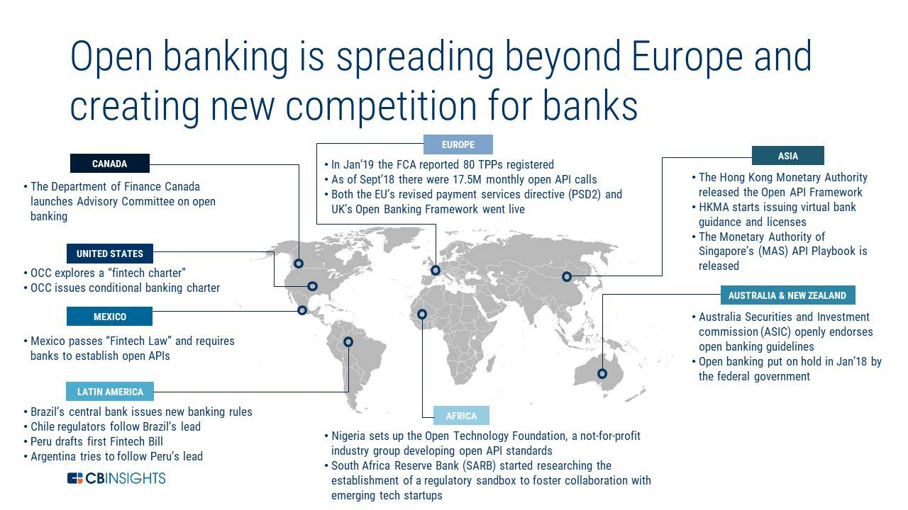
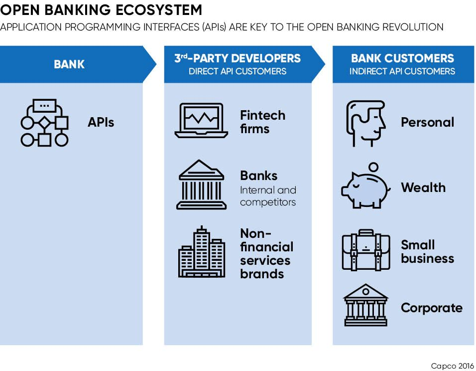
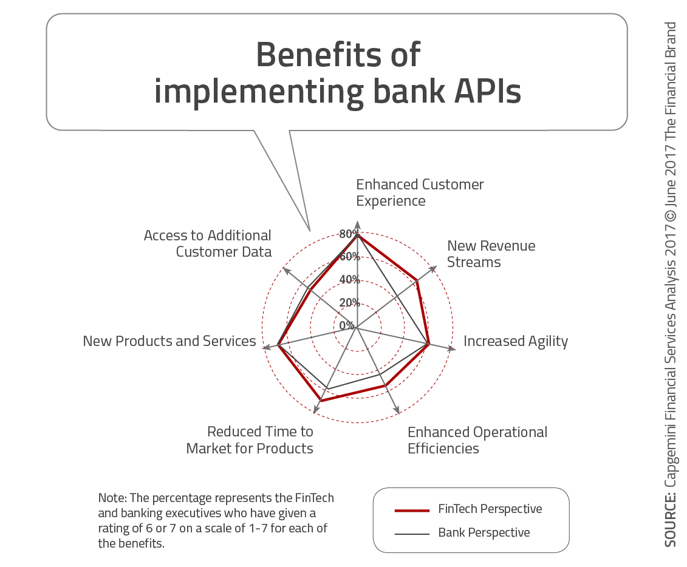
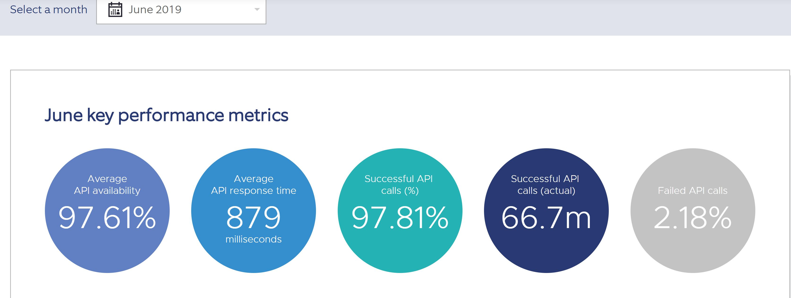

# eBanking Smart & Secure

This case study will explore how one of the FinTech Start Ups is using open banking framework to make it convinent and secured for
subscribers to connect to and initiate payments between various banks with ease.

## Overview and Origin

Company Name: [Yapily](https://www.yapily.com/)

The company is a London based fintech startup that was founded in mid-2017 by Stefano Vaccino who is an ex-Goldman Sachs employee. It provides an Open Banking-based API to help financial service providers and other enterprises to comminucate with banks.

The company has been funded by [**HV Holtzbrinck Ventures**](https://www.crunchbase.com/organization/holtzbrinck-ventures) and LocalGlobe. There are few other investors that include Taavet Hinrikus who is chairman and co-founder of [TransferWise](https://transferwise.com/us), Ott Kaukver who is CTO of [Twillio](https://www.twilio.com/) and Roberto Nicastro who was deputy CEO at [UniCredit](https://www.unicreditgroup.eu/en.html).

The API framework provides functionality to retrieve financial information and start payments using secure API that will connect to banks that supports open API.

## Business Activities

It started when European Union created an objective to provide a unified payment area where all local and international non-cash transactions can be handled with ease between national borders and at standard rates. With the publication of The Open Banking Standard, by Open Banking Working Group (OBWG), which provide guidelines on how to create,share and consume open banking data by their owners and who consume it. In a nutshell open banking provides a set of rules that allows the users to access information from different financial institutions through APIs and provides a convenient way to switch from one provider to a different provider, manage accounts like opening or closing and payments.

As the regulations made it easier for third parties to provide new services by accessing customer bank information,services like One-click-away has become easier and efficient.

Yapily's goal is to allow service providers to connect to their banks for both data access and to make payments through a single API. Just like a cloud provider, Yapily wants to position as a technology enabler by providing tools that an enterprise needs to easily manage their connectivity layer.

Yapily currently provides the following Software Development Kits(SDKs) and testing tools that allows to connect the APIs 

- JSON
- [Postman](https://www.getpostman.com/)
- Supports [HTTP Basic Authentication](https://developer.mozilla.org/en-US/docs/Web/HTTP/Authentication) or [Token Based Authentication](https://auth0.com/learn/token-based-authentication-made-easy/) to secure API endpoints.
- Java
- Node.js
- Python

For more information on Yapily's APIs can be found here 

- [API Docs](https://docs.yapily.com/?version=latest)

- [Yapily Developer Resources](https://github.com/yapily/developer-resources/wiki)

## Landscape

Yapily's core target financial domain is banking sector. With the Payment Service Directive 2 or PSD2 directive being implemented across European Union in January 2018, it tiggered open banking. The directive mandates that banks provide user financial data if user wishes to access through other service providers. This could be initiating payments, checking their account balances through mobile applications or giving lenders or insurers access to their account for quick loan affordability decisions.

Open Banking is being adopted globally as seen below

The following provides a simple overview of Open Banking Ecosystem

There are other competitors in the domain that provide services. Below list a few

- [Plaid](https://plaid.com/)
- [Tink](https://tink.com/)
- [MX](https://data.mx.com/role/fintech)
- [UTrust](https://utrust.com/)
- [HaveLife Insurance](https://havenlife.com/home.html)

## Results

Currently Yapily API allows support to 35 biggest banks in Europe, for retriving data and initiation of payments. This is equivalent to around 250 million bank accounts according to Yapily. The company is planning to connect to 536 more banks across Europe as they expose their APIs online adhering to European Union PSD2 legislation.

A few key metrics the companies use to determine their success are defined as shown in sample image

-

Since this startup started this year there isn't enough data to determine it's performance with other competitors.

## Recommendations

Yapily uses Standard HTTP Authenication or Token based Authenication, for this I would recommend to use Blockchain to provide security around any payment initiations or accessing bank information. By implementing Blockchain it will give opportunity for the client to start doing transactions using cryptocurrencies between financial institutions. Cyrptocurrency will become a future standard for open banking standard in a cashless society.

I would also recommend Yapily to use Artificial Intellegence or Machine Learning Technologies to analyze user's retireved data to provide product recommendations. This will provide Yapily with more target based products and improve their revenues.

## References

- [The Future of Banking](https://www.business-reporter.co.uk/2019/04/26/open-banking-is-flashing-bright-what-problems-can-it-solve/#gsc.tab=0)
- [TechCrunch Article About Yapily](https://techcrunch.com/2019/05/30/yapily/)
- [Open Banking](https://www.openbanking.org.uk/customers/what-is-open-banking/)

For Images

- [CB Isnights](https://www.cbinsights.com/research/open-banking-fintech-startups/)
- [Open Banking Ecosystem](https://www.pinterest.com/pin/671880838138261930/)
- [Benefits of Open Banking Api](https://thefinancialbrand.com/77869/innovation-trends-banking-ai-api-personalization-payments/)
- [Performance Metrics](https://www.openbanking.org.uk/providers/account-providers/api-performance/)
